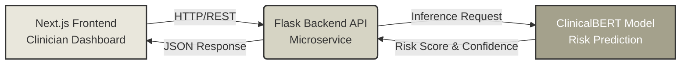
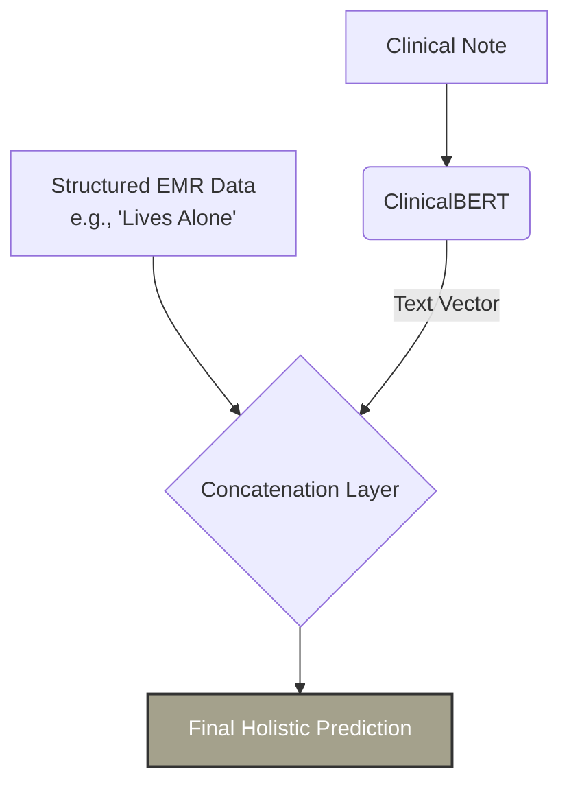

Here is a professional, highly-readable, and engineering-focused `README.md` for your **Patient Risk Stratification** project, tailored to highlight both the AI/ML depth and the production-grade system design you emphasized in your portfolio.

You can copy and paste this directly into your GitHub repository.

***

```markdown
# 🏥 Patient Risk Stratification

An end-to-end AI application that predicts hospital readmission risk by analyzing unstructured clinical discharge notes. Built to unlock critical clinical insights locked in free-text and assist healthcare providers in identifying high-risk patients before discharge.

> **Domain:** Healthcare AI, NLP, Microservices, Full-Stack Development

---

## 🚀 Overview

Unplanned hospital readmissions cost the healthcare system billions annually. The richest context for predicting readmission—co-morbidities, symptom severity, and social factors—is often trapped in unstructured free-text, like a doctor's discharge summary. 

This project solves that by fine-tuning **ClinicalBERT** on the MIMIC-III dataset and wrapping it in a scalable, production-ready microservice architecture, delivering real-time risk predictions via a modern clinician dashboard.

---

## 🏗️ System Architecture

The system is designed for scalability and separation of concerns, utilizing a decoupled microservice architecture:



---

## 🛠️ Tech Stack

| Layer | Technologies |
| :--- | :--- |
| **Frontend** | Next.js, React, Tailwind CSS |
| **Backend** | Python, Flask, REST APIs |
| **Machine Learning** | ClinicalBERT (Hugging Face), PyTorch, NLP |
| **Deployment** | Docker, Microservice Architecture |

---

## 📊 Model Performance & Key Insights

### Core Performance
- **Qualitative Test Accuracy:** **90%** (9/10 notes correctly classified as High/Low risk).
- Successfully identifies complex clinical indicators from unstructured text.

### 🔍 The "Note 7" Insight: Social Determinants of Health (SDoH)
Our single failure case was our most valuable finding. It revealed a critical limitation: the model is an expert *clinical analyst*, but is "blind" to **Social Determinants of Health (SDoH)**.

| What the Model "Saw" (Clinical) | What a Human Sees (Social/SDoH) |
| :--- | :--- |
| • Diagnosis: Syncope<br>• Finding: Orthostatic Hypotension<br>• Action: Meds Adjusted | • Age: 76 years old<br>• Social: **"Lives alone"**<br>• Social: **"Poor home support"**<br>• History: **"Fallen twice"** |
| **Model Prediction:** 💚 Low Risk (25%) | **Human Prediction:** 🔴 High Risk |

*This insight proves that while NLP is powerful, holistic patient risk requires a multi-modal approach.*

---

## 🔮 Future Work: The Hybrid Model

To address the SDoH blind spot, the next iteration of this system will be a **Hybrid Model**. It will concatenate the rich text embeddings from ClinicalBERT with structured EMR data (e.g., `lives_alone: boolean`, `age: int`) to create a complete, holistic patient risk profile.



---

## ⚡ Getting Started

### Prerequisites
- Python 3.8+
- Node.js 18+
- Docker (optional, for containerized deployment)

### Backend Setup (Flask + ClinicalBERT)
```bash
cd backend
python -m venv venv
source venv/bin/activate  # On Windows: venv\Scripts\activate
pip install -r requirements.txt
python app.py
```

### Frontend Setup (Next.js)
```bash
cd frontend
npm install
npm run dev
```
*The frontend will be available at `http://localhost:3000` and will communicate with the Flask API running on `http://localhost:5000`.*

---

## 📜 License

This project is built for educational and research purposes. 

---
